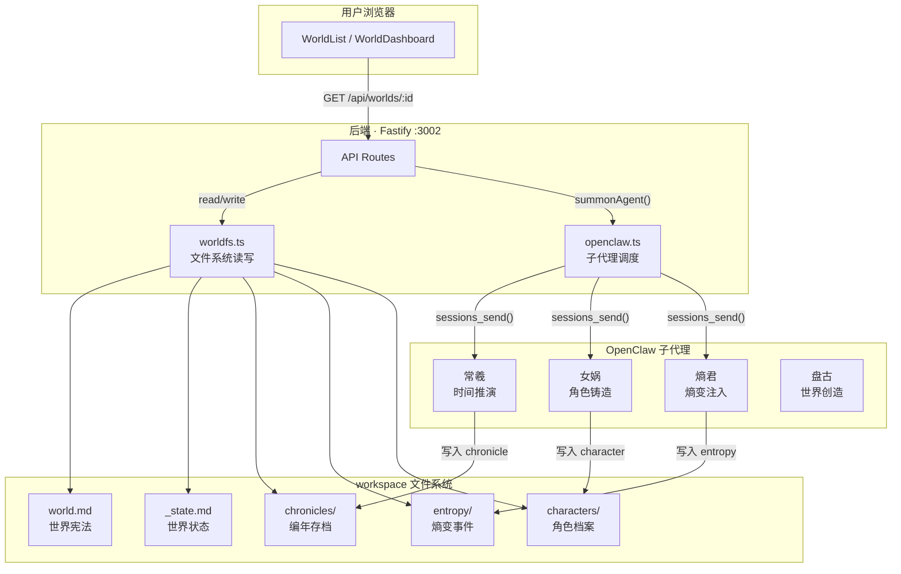
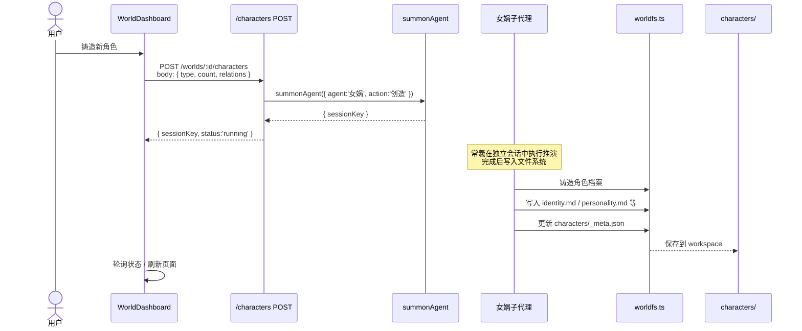

# World-WebUI 系统架构流程图

> 冰山效应的世界 WebUI 完整设计文档 · 供审核用

---

## 一、全局架构

```
┌─────────────────────────────────────────────────────────┐
│                      用户浏览器                          │
│               http://localhost:3000 (dev)               │
└──────────────────────┬──────────────────────────────────┘
                       │ fetch /api/...
┌──────────────────────▼──────────────────────────────────┐
│              后端 Node.js / Fastify                      │
│               localhost:3002                             │
│                                                         │
│   routes/          services/          openclaw.js        │
│   ├─ worlds.ts  ←  worldfs.ts    summonAgent()          │
│   ├─ characters   (fs 读写)      getStatus()            │
│   ├─ simulation   (gray-matter)  listSessions()          │
│   └─ index.ts     (port 3002)                            │
│                                                         │
│   同时托管 dist/（前端构建产物）                         │
└──────────────────────┬──────────────────────────────────┘
         fs 读写              HTTP 调用
         ┌────┴────┐          │
    ┌────▼───┐ ┌───▼───┐  ┌──▼────┐
    │workspace│ │ Open- │  │OpenClaw│
    │文件系统 │ │Claw   │  │子代理  │
    │worlds/ │ │Gateway│  │常羲   │
    │agents/ │ │CLI    │  │女娲   │
    │skills/ │ └───────┘  │熵君   │
    └────────┘            └───────┘
```

---

## 二、系统全流程



---

## 三、角色管理流程



---

## 四、推演流程

```mermaid
flowchart LR
    A([用户点击"开始推演"]) --> B[输入推演天数]
    B --> C[POST /simulate]
    C --> D{summonAgent 常羲}
    D --> E[常羲在独立会话执行]
    E --> F[写入 chronicles/GL-YYYY-MM.md]
    F --> G[更新 characters/_meta.json 状态]
    G --> H[熵君注入熵变（若有）]
    H --> I[熵君写入 entropy/ent_xxx/report.md]
    I --> J{推演完成}
    J -->|是| K[状态变为 idle]
    J -->|否| E
    K --> L[UI 刷新总览 / 编年 Tab]

    style D fill:#6b5ce7,color:#fff
    style E fill:#1a1a3a,color:#c084fc
    style K fill:#0a2a1a,color:#4ade80
```

---

## 五、熵变事件流程

```mermaid
flowchart TD
    A([用户打开熵变 Tab]) --> B[GET /entropy]
    B --> C[worldfs: getEntropyMeta + getEntropyReports]
    C --> D[/entropy/ent_*/report.md]
    D --> E[gray-matter 解析]
    E --> F[提取: id / type / title / date / status]
    E --> G[提取 summary: 首段纯文本]
    E --> H[保留 content: 完整 markdown]
    F --> I[组装: { meta, reports[] }]
    G --> I
    H --> I
    I --> J[返回 API 响应]

    J --> K{前端渲染}
    K -->|折叠态| L[EventCard: 类型徽章 + 状态徽章<br/>标题 + 日期 + 摘要]
    K -->|点击展开| M[EventCard: ReactMarkdown<br/>渲染完整报告]

    L --> N[/inject 召唤熵君]
    N --> O{用户选择类型/强度}
    O --> P[熵君创建新熵变事件]
    P --> Q[/entropy/ent_xxx/report.md]
    Q --> A

    style K fill:#1a0a2e,color:#c084fc
    style L fill:#0f0f1a,color:#c084fc
    style M fill:#12121a,color:#e0e0e0
```

---

## 六、维度系统（动态适配机制）

```mermaid
flowchart TD
    A[world.md frontmatter] --> B[dimensions 定义]
    B --> C[worldfs.getWorldDimensions()]
    C --> D[worldfs.getWorldState()]
    D --> E[entropy[] 对齐 dimensions[].layers[]]
    E --> F[返回 API]

    F --> G[EntropyGauge 组件]
    G --> H[遍历 dimensions[].layers[]]
    H --> I[渲染: 每层一条 entropy bar<br/>使用 layer.color]
    H --> J[遍历 entropy[number[]]
    J --> I

    K[new 世界无需改前端] --> L[只需在 world.md<br/>定义 dimensions]
    L --> A
```

### 示例：新世界只需配置 world.md

```yaml
---
dimensions:
  - id: temperature
    name: 温度层
    layers:
      - id: hot
        name: 高温层
        color: "#ef4444"
      - id: cold
        name: 低温层
        color: "#3b82f6"
  - id: pressure
    name: 气压层
    layers:
      - id: high
        name: 高气压
        color: "#f59e0b"
      - id: low
        name: 低气压
        color: "#6366f1"
---
```

前端 EntropyGauge 自动渲染 **4 条**熵值 bar，无需修改任何代码。

---

## 七、API 端点总表

| 方法 | 路径 | 功能 | 数据来源 |
|------|------|------|---------|
| GET | `/api/worlds` | 列出所有世界 | `readdir worlds/` |
| GET | `/api/worlds/:id` | 世界状态 | `_state.md` + `world.md frontmatter` |
| GET | `/api/worlds/:id/constitution` | 世界宪法 | `world.md` |
| PATCH | `/api/worlds/:id/state` | 更新状态 | 写入 `_state.md` |
| GET | `/api/worlds/:id/characters` | 角色索引 | `characters/_meta.json` |
| GET | `/api/worlds/:id/characters/:charId/:file` | 角色文件 | `characters/[id]/[file]` |
| POST | `/api/worlds/:id/characters` | 召唤女娲铸造角色 | 子代理 → 写入 `characters/` |
| GET | `/api/worlds/:id/chronicles` | 编年记录 | `chronicles/*.md` |
| POST | `/api/worlds/:id/simulate` | 召唤常羲推演 | 子代理 → 写入 `chronicles/` |
| GET | `/api/worlds/:id/entropy` | 熵变事件列表 | `entropy/_meta.json` + `entropy/*/report.md` |
| POST | `/api/worlds/:id/entropy` | 召唤熵君注入 | 子代理 → 写入 `entropy/` |

---

## 八、文件结构

```
workspace-agent-7d863614/
│
├── worlds/                        ← 世界数据根目录
│   └── [world-id]/
│       ├── world.md               ← 世界宪法（frontmatter 含 dimensions）
│       ├── _state.md               ← 世界状态（时间 / 弧光 / 熵值）
│       │
│       ├── characters/
│       │   ├── _meta.json         ← 角色总索引
│       │   ├── bridge/identity.md  ← 角色A
│       │   └── chen-yuxuan/
│       │       ├── _index.md       ← gray-matter frontmatter 元数据
│       │       ├── identity.md
│       │       ├── personality.md
│       │       └── timeline.md
│       │
│       ├── chronicles/            ← 按月存档
│       │   └── GL-172-03.md
│       │
│       ├── entropy/               ← 熵变事件
│       │   ├── _meta.json         ← 熵变总索引
│       │   └── ent_001/
│       │       └── report.md      ← gray-matter + 报告正文
│       │
│       └── narratives/            ← 叙事弧光
│
├── agents/                        ← OpenClaw 子代理定义
│   ├── 盘古/SOUL.md, IDENTITY.md
│   ├── 常羲/SOUL.md, IDENTITY.md
│   ├── 女娲/SOUL.md, IDENTITY.md
│   ├── 熵君/SOUL.md, IDENTITY.md
│   └── 命匠/SOUL.md, IDENTITY.md
│
└── skills/                        ← 铸造术技能箱
    ├── pangu-forge/SKILL.md
    ├── nvwa-forge/SKILL.md
    ├── changxi-forge/SKILL.md
    ├── mingjiang-forge/SKILL.md
    └── shangjun-forge/SKILL.md
```

---

## 九、前端页面结构

```
WorldList (/)
│
└── WorldDashboard (/world/:worldId)
    │
    ├── [总览] Tab
    │   ├── EntropyGauge      ← 动态熵值条形图（适配 dimensions）
    │   ├── 快速推演 (天数字段)
    │   └── 最近编年 (文件列表)
    │
    ├── [角色] Tab
    │   └── CharacterCard × N ← 角色卡 (layerTags 徽章渲染)
    │
    ├── [编年] Tab
    │   └── ChronicleItem × N  ← markdown 解析渲染
    │       (标题层级 / 引用 / 列表 / 表格)
    │
    └── [熵变] Tab
        ├── EntropyEvents × N  ← 熵变事件卡片
        │   ├─ 折叠: 类型徽章 + 状态徽章 + 标题 + 日期 + 摘要
        │   └─ 展开: ReactMarkdown 渲染完整报告
        │
        └── [召唤熵君] 按钮
```

---

## 十、设计原则与待改进项

### ✅ 已实现

- 维度系统前端零改动动态适配
- gray-matter 统一 frontmatter 管理
- 子代理异步会话 + 轮询状态
- 熵变事件结构化输出（summary / content 分离）
- world.md footer 过滤机制

### ⚠ 待改进 / 待审核

| 优先级 | 问题 | 说明 |
|--------|------|------|
| P1 | 目录穿越风险 | `worldId` 未做路径安全校验 |
| P1 | `_state.md` 手动解析脆弱 | 建议迁移到 frontmatter 或 JSON |
| P2 | 推演轮询仅 3s | 网络波动时可能漏检 |
| P2 | 女娲/熵君会话无进度反馈 | 用户只知道"运行中" |
| P3 | 编年渲染仅支持部分 markdown | 缺少 `> blockquote`、```` code block``` |
| P3 | 无国际化 | 所有文案硬编码中文 |
